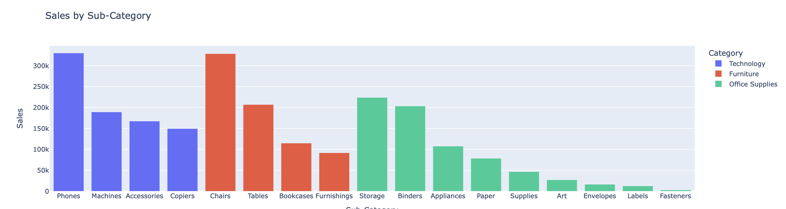

# Sales Analysis Dashboard

This project is an interactive dashboard for analyzing sales data from the Superstore company. It is built with Python, Dash, and Plotly, and allows you to visualize sales, profits, and other key metrics.

## Features

- **Interactive Visualizations**: Explore data with interactive charts.
- **Region Filtering**: Select a region to display corresponding data.
- **USA Map**: Click on a state to zoom in and view sales by city.
- **Various Charts**: Sales by category, profits by sub-category, monthly trends, etc.

## Screenshots

### 1. Dashboard Overview


### 2. USA Map with State Zoom


### 3. Sales by Category


### 4. Sales by Sub-Category


### 5. Profits by Sub-Category


### 6. Monthly Sales Trend


## How to Use

1. **Clone the Repository**:
   ```bash
   git clone https://github.com/Adlan-Boithier/Sales-Analysis.git
   cd Sales-Analysis